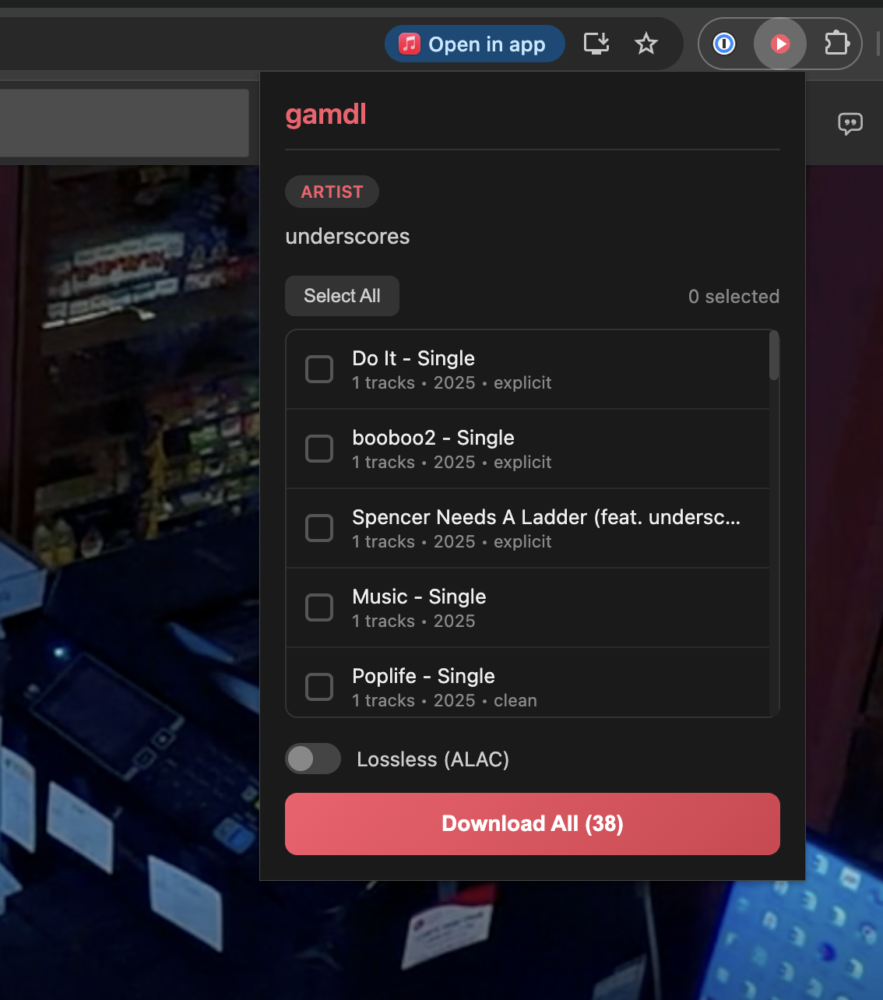

# gamdl Chrome Extension

A Chrome extension for downloading Apple Music tracks using [gamdl](https://github.com/glomatico/gamdl).



## Features

- Download songs, albums, playlists, and artist discographies
- Select specific albums/tracks to download
- Lossless (ALAC) support with wrapper mode
- Real-time download progress tracking
- Automatically detects already-downloaded albums

## Requirements

- **Google Chrome** (or Chromium-based browser)
- **Python 3.8+**
- **gamdl** - `pip install gamdl`
- **ffmpeg** - For audio processing
- **Apple Music cookies** - Exported from your browser

### For Lossless (ALAC) Downloads

- **Docker** - With the wrapper container running
- **Bento4** - `brew install bento4` (for mp4decrypt)
- **amdecrypt** - Decryption binary

## Quick Setup

Run the interactive setup utility:

```bash
cd gamdl-extension
./setup.sh
```

This will guide you through:
1. Checking dependencies
2. Configuring output paths
3. Installing the Chrome extension
4. Setting up the native messaging host
5. Optional lossless support

## Manual Installation

### 1. Install gamdl

```bash
pip install gamdl
```

Or use the project's virtual environment:

```bash
cd /path/to/gamdl
python -m venv .venv
source .venv/bin/activate
pip install -e .
```

### 2. Export Apple Music Cookies

1. Install a cookie export extension (e.g., "Get cookies.txt LOCALLY")
2. Log into [music.apple.com](https://music.apple.com)
3. Export cookies in Netscape format
4. Save to `~/.gamdl/cookies.txt`

### 3. Configure gamdl

Create `~/.gamdl/config.ini`:

```ini
[gamdl]
output_path = ~/Music/Apple Music
cookies_path = ~/.gamdl/cookies.txt
```

### 4. Load the Extension in Chrome

1. Open `chrome://extensions`
2. Enable **Developer mode** (top right toggle)
3. Click **Load unpacked**
4. Select the `gamdl-extension` folder
5. Note the 32-character extension ID

### 5. Install Native Messaging Host

```bash
./native-host/install.sh <extension-id>
```

Or use the setup utility:

```bash
./setup.sh
```

### 6. Restart Chrome

Completely quit Chrome (Cmd+Q on macOS) and reopen it.

## Usage

1. Navigate to any Apple Music page:
   - Artist page → Download entire discography or select albums
   - Album page → Download full album or select tracks
   - Playlist → Download all tracks
   - Single song → Download that track

2. Click the gamdl extension icon

3. Toggle **Lossless (ALAC)** if desired (requires wrapper)

4. Click **Download** or select specific items first

5. Watch the progress in real-time

## Lossless Setup

For ALAC downloads, you need the wrapper running:

```bash
# Pull and run the wrapper container
docker run -d \
  --platform linux/amd64 \
  -p 10020:10020 \
  -p 20020:20020 \
  -p 30020:30020 \
  --name gamdl-wrapper \
  your-wrapper-image
```

Ensure `amdecrypt` is in your PATH and not quarantined (macOS):

```bash
xattr -d com.apple.quarantine /path/to/amdecrypt
```

## Troubleshooting

### Extension not connecting to native host

1. Check the manifest is installed:
   - macOS: `~/Library/Application Support/Google/Chrome/NativeMessagingHosts/com.gamdl.host.json`
   - Linux: `~/.config/google-chrome/NativeMessagingHosts/com.gamdl.host.json`

2. Verify the extension ID in the manifest matches your installed extension

3. Restart Chrome completely

### Downloads not starting

1. Check browser console for errors (F12 → Console)
2. Verify cookies.txt is valid and not expired
3. Ensure gamdl works from command line: `gamdl "https://music.apple.com/..."`

### ALAC downloads failing

1. Ensure Docker is running with the wrapper container
2. Check that `mp4decrypt` is in PATH: `which mp4decrypt`
3. Verify `amdecrypt` is executable and not quarantined
4. On macOS, grant Full Disk Access to Chrome if accessing network drives

### Permission errors on network drives

On macOS, Chrome needs Full Disk Access to read/write network shares:
1. System Settings → Privacy & Security → Full Disk Access
2. Add Google Chrome

## Uninstalling

```bash
./uninstall.sh
```

Or manually:

1. Remove from Chrome: `chrome://extensions` → Remove
2. Delete native host manifest:
   - macOS: `rm ~/Library/Application\ Support/Google/Chrome/NativeMessagingHosts/com.gamdl.host.json`
   - Linux: `rm ~/.config/google-chrome/NativeMessagingHosts/com.gamdl.host.json`

## Development

The extension consists of:

- `manifest.json` - Chrome extension manifest
- `popup.html/js/css` - Extension popup UI
- `background.js` - Service worker for native messaging
- `native-host/gamdl_host.py` - Native messaging host (Python)

### Testing Changes

1. Make changes to the code
2. Go to `chrome://extensions`
3. Click the refresh icon on the extension
4. Test the changes

## License

MIT License - See the main gamdl repository for details.
